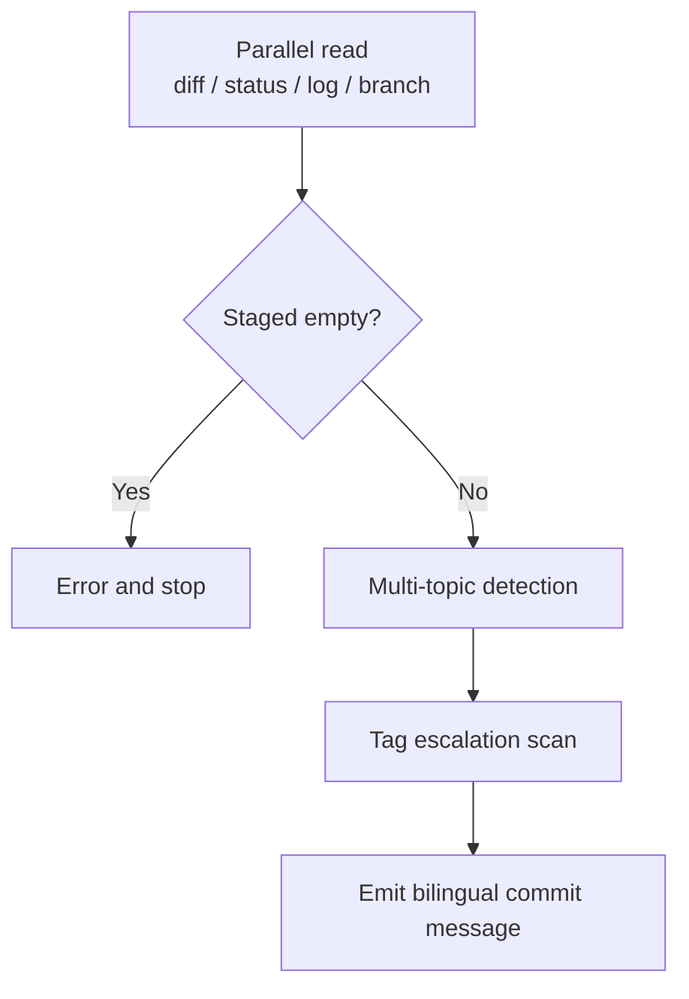

> [!NOTE]
> This README was generated by [SKILL](https://github.com/agenvoy/skill-readme-generate), get the ZH version from [here](./doc/README.zh.md). 
> This skill's implementation was fully agent-generated; the developer only tuned its input/output.

***

<strong>WRITE BILINGUAL COMMITS FROM STAGED DIFF WITH STRICT TAG DISCIPLINE!</strong>

***

> An agent skill with bilingual commit messages, mandatory tag escalation, and multi-topic split detection

## Table of Contents

- [Features](#features)
- [Architecture](#architecture)
- [License](#license)

## Features

> `/commit-generate` · [Documentation](./doc/doc.md)

- **Staged-Only Content** — Describes nothing but `git diff --cached` and stops with an error when nothing is staged, never falling back to the working tree.
- **Mandatory Tag Escalation** — Scans Breaking and Security signals top-down; any hit forces the tag up and blocks downgrades to `feat` or `update`.
- **Multi-Topic Split Detection** — Lists a split plan before the rollup message when a diff spans 2+ primary tags or 3+ unrelated topics.
- **Unstaged File Reminder** — Flags same-module files left unstaged above the message, leaving the `git add` decision to the user.
- **Repo-Consistent Wording** — Borrows module names and phrasing from `git log` and the branch name while tag choice stays rule-driven.

## Architecture

> [Full Architecture](./doc/architecture.md)

## License

This project is licensed under the [MIT LICENSE](LICENSE).
