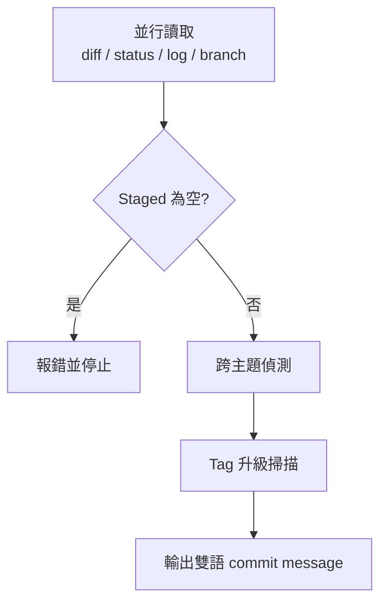

> [!NOTE]
> 此 README 由 [SKILL](https://github.com/agenvoy/skill-readme-generate) 生成，英文版請參閱 [這裡](../README.md)。 
> 此 skill 的實作內容全由 agent 生成，開發者僅針對 input / output 進行調整。

***

<strong>WRITE BILINGUAL COMMITS FROM STAGED DIFF WITH STRICT TAG DISCIPLINE!</strong>

***

> Agent Skill，具備雙語 commit message、強制 Tag 升級與跨主題拆分偵測

## 目錄

- [功能特點](#功能特點)
- [架構](#架構)
- [授權](#授權)

## 功能特點

> `/commit-generate` · [完整文件](./doc.zh.md)

- **僅描述 Staged 內容** — 只以 `git diff --cached` 為內容來源，無 staged 變更時直接報錯停止，不回退到工作區。
- **強制 Tag 升級** — 由上而下掃描 Breaking 與 Security 訊號，命中即強制升級，不允許降級為 `feat` 或 `update`。
- **跨主題拆分偵測** — 觸及 2 個以上主要 Tag 或 3 個以上無關主題時，先列出拆分建議再給概括 message。
- **漏 Stage 提醒** — 同模組卻未 stage 的檔案會在 message 前列出，由使用者決定是否補 `git add`。
- **沿用既有用詞** — 參考 `git log` 與分支名決定模組稱呼與措辭，Tag 選擇仍以規範為準。

## 架構

> [完整架構](./architecture.zh.md)

## 授權

本專案採用 [MIT LICENSE](../LICENSE)。
