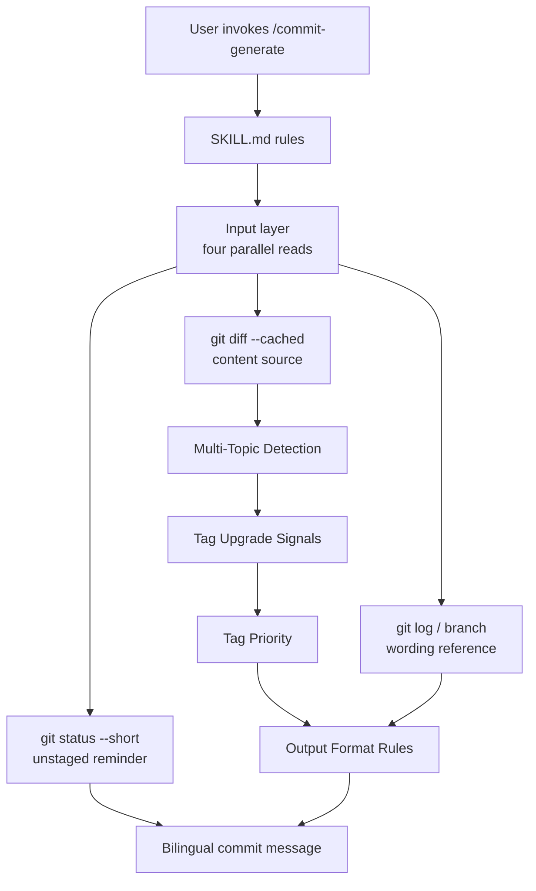
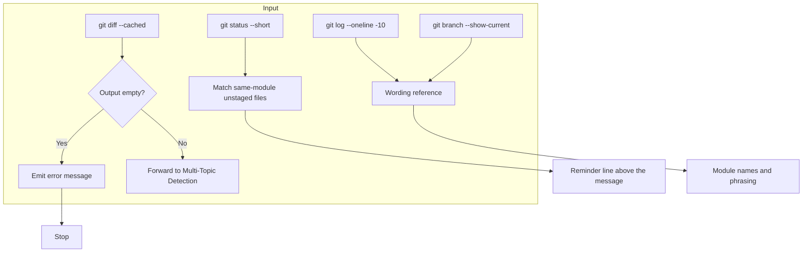
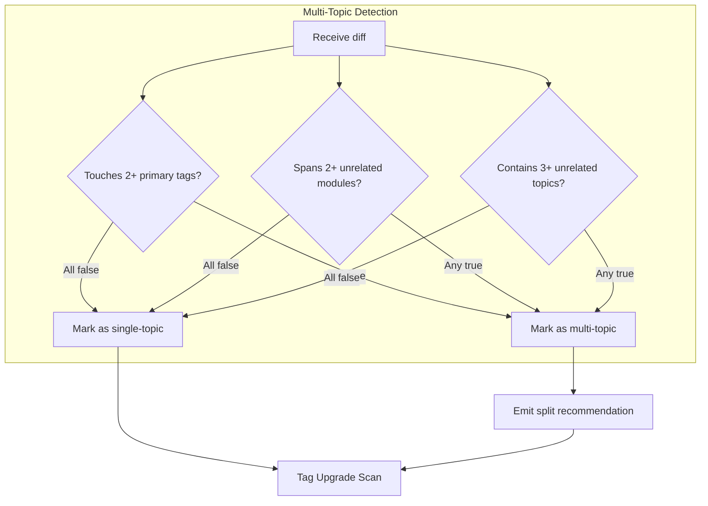
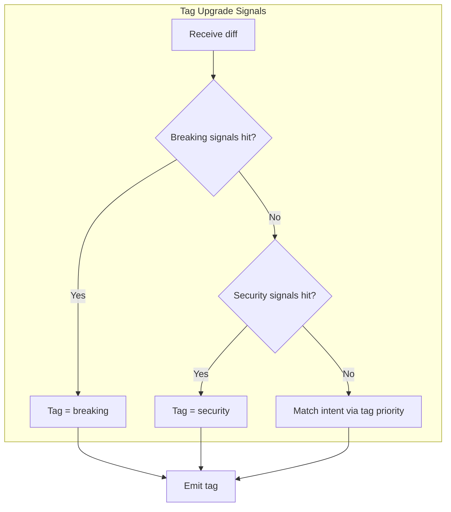
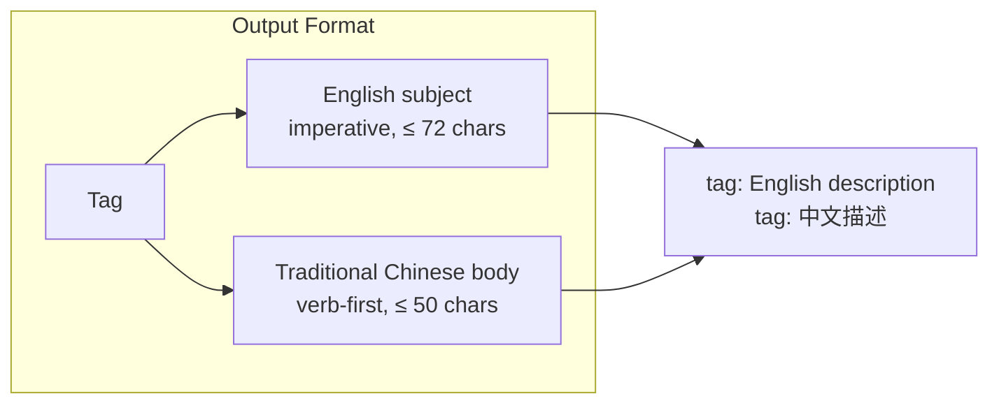
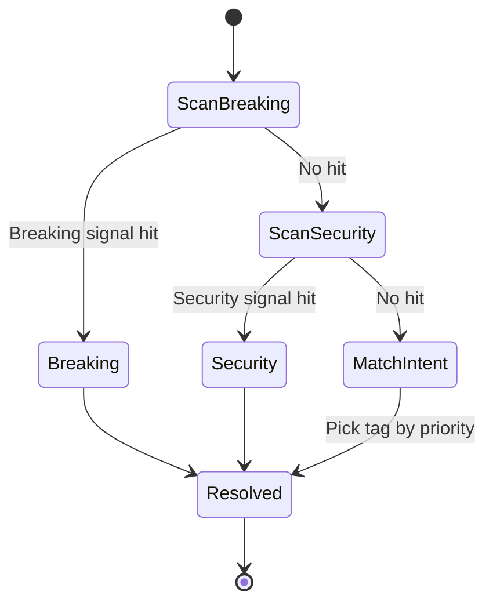

# commit-generate - Architecture

> Back to [README](../README.md)

## Overview

## Module: Input

Reads four sources in one parallel round; an empty diff stops with an error and never falls back to the working tree.

## Module: Multi-Topic Detection

Decides whether a single diff mixes unrelated intents and, if so, emits a split recommendation.

## Module: Tag Upgrade Signals

Scans signals top-down; any hit forces an upgrade and blocks downgrades to `feat` or `update`.

## Module: Output Format

Builds the English subject and Traditional Chinese body from a single tag.

## Data Flow

```mermaid
sequenceDiagram
    participant User
    participant Agent as Agent Harness
    participant Skill as SKILL.md
    participant Git

    User->>Git: git add <files>
    User->>Agent: /commit-generate
    Agent->>Skill: Load skill definition
    par Parallel reads
        Skill->>Git: git diff --cached
        Skill->>Git: git status --short
        Skill->>Git: git log --oneline -10
        Skill->>Git: git branch --show-current
    end
    Git-->>Skill: Four results
    alt Diff empty
        Skill-->>User: No staged changes
    else Diff present
        Skill->>Skill: Multi-topic detection
        Skill->>Skill: Tag upgrade scan
        Skill->>Skill: Apply output format
        opt Same-module files unstaged
            Skill-->>User: Reminder line
        end
        opt Multi-topic
            Skill-->>User: Split recommendation
        end
        Skill-->>User: Bilingual commit message
    end
```

## Tag Decision State Machine

