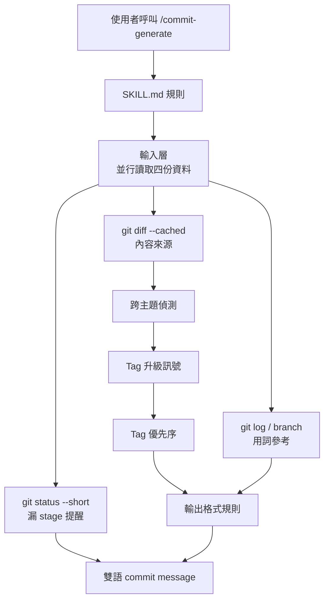
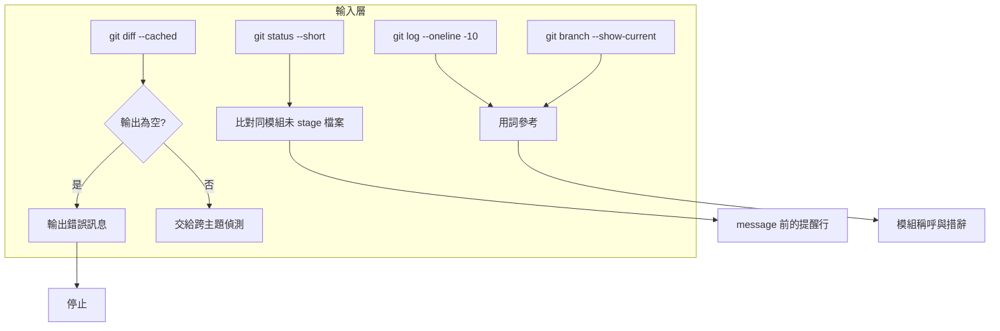
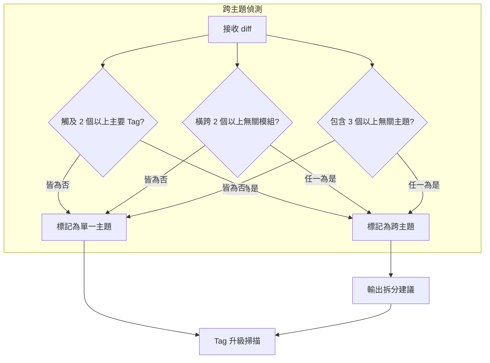
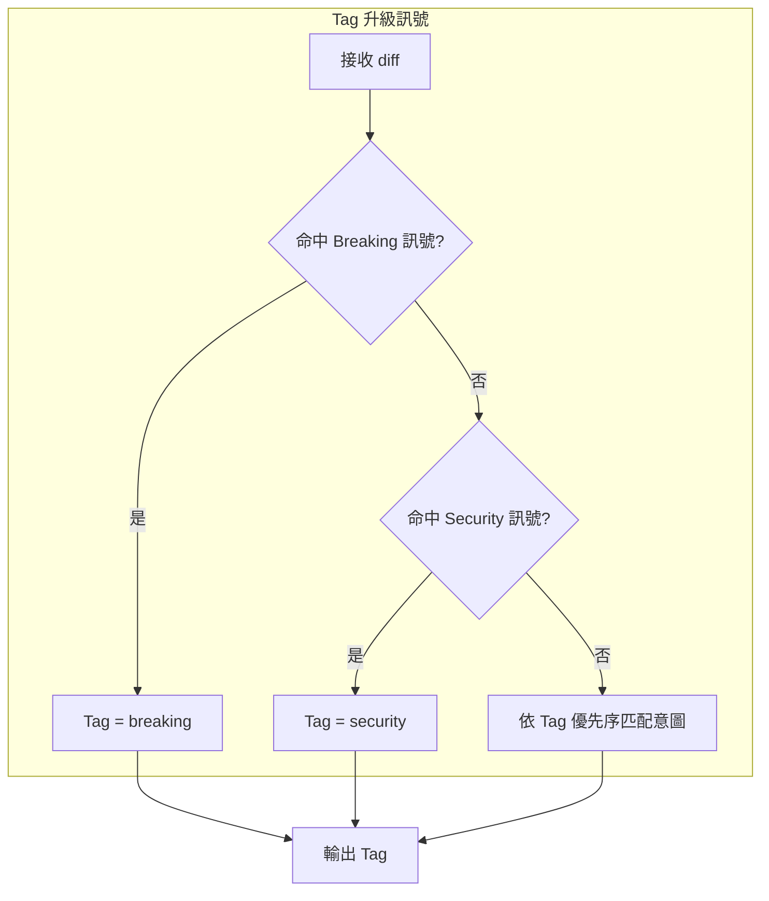
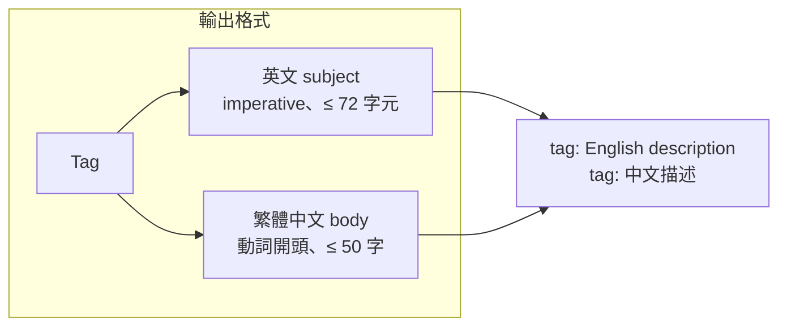
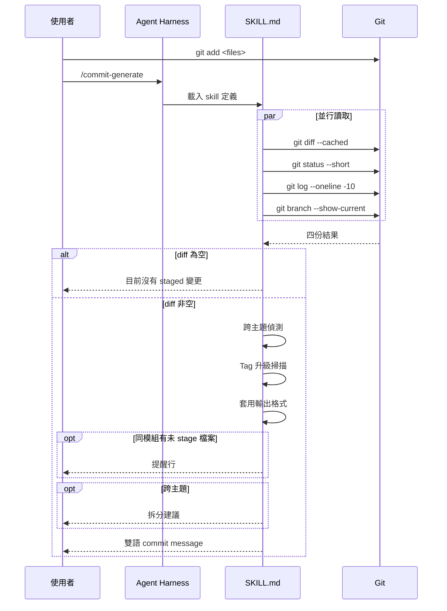
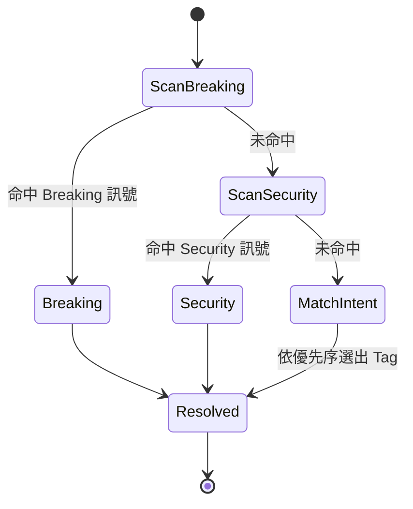

# commit-generate - 架構

> 返回 [README](./README.zh.md)

## 概覽

## Module: 輸入層

同一輪並行讀取四份資料；diff 為空時直接報錯停止，不回退到工作區。

## Module: 跨主題偵測

判斷單次 diff 是否混雜無關意圖，命中則輸出拆分建議。

## Module: Tag 升級訊號

由上而下掃描訊號，命中即強制升級並禁止降級為 `feat` 或 `update`。

## Module: 輸出格式

以單一 Tag 組出英文 subject 與繁體中文 body。

## 資料流

## Tag 決策狀態機

